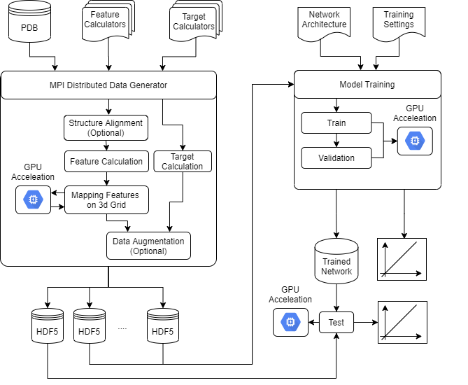
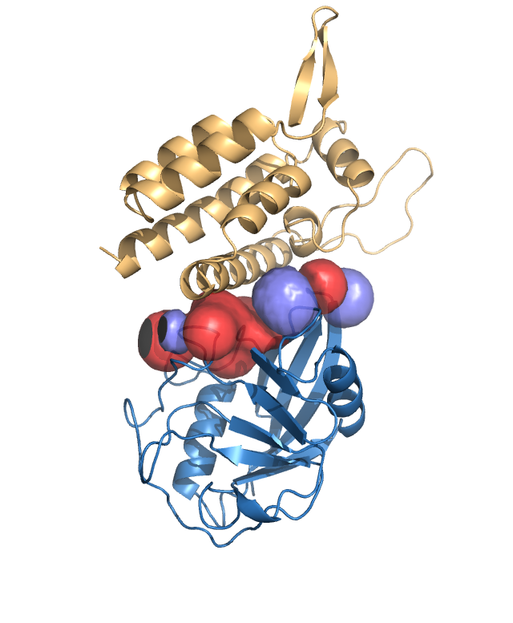

# Summary

Understading how proteins interact and bind with each other is a fundamental task in computational biology with applications ranging from drug design to catalysis. A large number of computational methods have been developped to circumvent the important experimental costs associated with caracterizing protein-protein interfaces (PPIs). These approaches are usually done in two sequential steps: first a large number of potential PPIs are generated using molecular dynamics or similar techniques. Then the resulting interfaces are scored to predict which ones are most likely to occur in nature. We focus in this paper on the second task, i.e. the ranking of pre-generated PPIs. Many so-called scoring functions have been developped in to rank PPIs. Most of these functions are physics based like HADDOCK [@haddock] or pyDock [@pydock] and combine different energetic terms to assess PPIs. More recently machine learning approaches such as iScore [@iscore] and XXX [] have been developped with the goal to go beyond physics-based approaches and provide with a better ranking.


In this paper we present a python package called `DeepRank` that uses featurization of the PPIs based on 3D grid Gaussian expansion and 3D CNN to rank PPIs. `DeepRank` provides an easy to use interface to featurize the PPIs, and then train/validate/test a model for PPI ranking. We present the architecture of the software and illustrate its use on a very simple dataset.  
 
# Software architecture

`DeepRank` is a Python3 pacakge  that allows for end-to-end training of neural network models on PPI data. The overall architecture of the package is shown in Fig. \autoref{fig:arch}. The package consists of two main parts: 1 - the featurization of the PPI and their mapping on 3D grid. 2 - training of 3D CNN models based on this features. For the featurization, users only have to provide with the PDBs of the PPIs, and optionally feature and target calculators. Natively `DeepRank` provides a collection of such calculator as listed in Table 1. This feature are initially localized on a given atom or residue and are then mapped onto a user-defined 3D grid using a gaussian expansion that can be offloaded to GPU. The GPU kernels can be tuned for different architecture using the Kernel Tuner [@kerneltunner]. Optionally, each PPI can be aligned along a given axis and data augmentation can be performed by duplication each PPI and rotating it to enrich the dataset. Internally the handling of the PDB files is performed using `pdb2sql` [@pdb2sql]. The result of the featurization is stored in a dedicated HDF5 file containing all the information of all the PPI considered. As seen in Fig. \autoref{fig:arch} the calculation of the features and targets is parallelized using MPI, each MPI process taking care of a part of the entire dataset and generates its own HDF5 file. These HDF5 files are then used to train a 3D CNN model. Here the user only needs to provide the model to be used and specify the training parameters. The training is based on pytorch [@pytorch] and can use all the optimizers, loss function etc ... provided by pytorch.

A dedicated hdf5 browser, based on `h5x` [@h5x] is included in `DeepRank` to allow users to navigate and visualize the features and the results of the training. A screenshot of this browser is shown in Fig. \autoref{fig:arch}. Features can be visualized in popular molecular viewer such as PyMol [@pymol] or VMD [@vmd].




#Usage

To illustrate the use of `DeepRank`, we will consider a very small data set made ou of 400 PPIs create from the 1AK4 PDB entry using the HADDOCK docking software. This dataset can be found here. This dataset also contains the native docking conformation that has been characterized experimentally. This reference conformation is necessary to compute the different metrics (irmsd, dockQ, etc ...) assessing the quality of the other docking conformations. In addition we also provide here position specific scoring matrix (PSSM) of the 1AK4 complex that is needed to compute the PSSM features. This files can easily be generated using our `PSSMGen` tool [@pssmgen]

## Featurization

Once all the input PDB and PSSM files are in place, the `DataGenerator` class of `DeepRank` orchestrates the featurization and mapping of the features. An snippet of code illustrating the data generation is shown below. Some of the `DataGenerator` has arguments are illustrated here in the instantiation of the generator: the locations of the different input files necessary; a posible alignment of the PPIs; the name of the output HDF5 file etc ... By default all the features and targets listed in Table 1 will be computed. However user can only choose to comptue a few of them or even define their own calculator and use them here. See the documentatin for more information. Once instantiated, the `create_database()` method will compute all the feature and target values. It is then possible to define the number of points and spacing between grid points to be used for the mapping. This grid is then used to map all the features.


```python
from deeprank.generate import DataGenerator
from mpi4py import MPI

# Initialize the database
database = DataGenerator( pdb_source='1AK4/decoys/', pdb_native='1AK4/native/', pssm_source='1AK4/pssm/',
    align={"selection":"interface", "plane":"xy", 'export':True}, hdf5='1ak4.hdf5', mpi_comm=MPI.COMM_WORLD)

# Compute the features and targets
database.create_database()

# Define the 3D grid
grid_info = {'number_of_points' : [30,30,30], 'resolution' : [1.,1.,1.]}

# Map the features
database.map_features(grid_info)
```


## Model Training

Starting from the HDF5 file generated in the previous step, we can now train a neural network model using `DeepRank`. A snippet of code illustrating this is shown below. We first must define an instance of the `DataSet` class. In it's simple form the dataset only needs the name of the HDF5 file containing the mapped features and the name of the target to use, here the interface RMSD. The data set has many more options that allows for example to only select PPIs with certain metric properties, e.g. IRSMD values lower than 4 and  larger than 10. This dataset is then used to instantiate a `NeuralNet`. This class also takes as input the neural network architecture to be used. `DeepRank` provides a few of these architectures but user can easily define their own networks. Once all of that is defined we can train the model for a certain number of epoch. Other options are also available to fine tune the training such as the division of the train/valid/test, mini-batch size, etc ... All the results of the training will be exported in a single HDF5 file that can easily been explored using `h5x`.


```python
from deeprank.learn import DataSet, NeuralNet
from deeprank.learn.model3d import cnn_reg as cnn3d

# Create data set
data_set = DataSet('1ak4.hdf5', select_target='IRMSD')

# create the network
model = NeuralNet(data_set, cnn3d, task='reg')

# start the training
model.train(nepoch=50, divide_trainset=[0.7,0.2,0.1],
            train_batch_size=5, save_model='all')
 
```

# Acknowledgements

We acknowledge contributions from Brigitta Sipocz, Syrtis Major, and Semyeong
Oh, and support from Kathryn Johnston during the genesis of this project.

# References